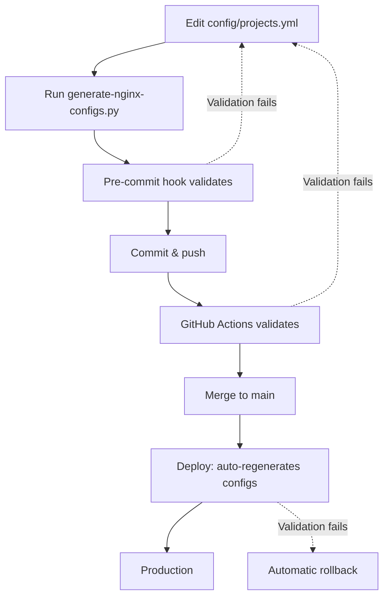

# CLAUDE.md - Multi-Tenant Platform

**Infrastructure platform for hosting multiple web applications** with shared nginx reverse proxy, SSL management, monitoring, and performance optimization.

---

## 🎯 PLATFORM OVERVIEW

### Hosted Projects
- **filter-ical** (filter-ical.de) - iCal filtering service
- **paiss** (paiss.me) - Personal website
- **monitoring** (monitoring.paiss.me) - Grafana dashboard

### Infrastructure Services
- **Platform Nginx** - HTTP/2 & HTTP/3 reverse proxy with SSL termination
- **Certbot** - Automatic SSL certificate management
- **Prometheus** - Metrics collection
- **Grafana** - Metrics visualization
- **Alertmanager** - Alert routing
- **Node Exporter** - Server metrics
- **cAdvisor** - Container metrics

---

## 🏗️ ARCHITECTURE

### Request Flow
```
User Request
  ↓
Platform Nginx (HTTP/3, HTTP/2, TLS)
  ↓
Project Container (filter-ical-frontend, paiss-web, etc.)
  ↓
Backend Container (if applicable)
```

### Directory Structure
```
multi-tenant-platform/
├── platform/                      # Shared infrastructure
│   ├── docker-compose.platform.yml  # Platform services
│   ├── nginx/
│   │   ├── nginx.conf              # Main config (HTTP/3, compression, security)
│   │   ├── conf.d/                 # Per-project routing (auto-generated)
│   │   └── includes/               # Reusable config snippets
│   └── monitoring/                 # Prometheus, Grafana configs
│
├── configs/                       # Per-project deployment configs
│   ├── filter-ical/
│   │   ├── docker-compose.yml      # Project containers
│   │   ├── nginx.conf              # Project routing rules
│   │   └── .env.production
│   └── paiss/
│       └── docker-compose.yml
│
└── scripts/                       # Deployment & management
```

---

## 🚀 HTTP/3 & PERFORMANCE

### Protocol Support
**✅ Enabled Platform-Wide (2025-10-01)**

All projects automatically benefit from:
- **HTTP/3 (QUIC)** - UDP-based protocol for mobile & unstable networks
- **HTTP/2** - TCP-based with multiplexing
- **0-RTT Connection Resumption** - ~100-200ms faster repeat connections
- **Connection Migration** - Seamless WiFi ↔ mobile data switching

**Implementation:**
- **Platform Nginx:** `macbre/nginx-http3:latest` Docker image
- **Ports:** TCP 443 (HTTP/2) + UDP 443 (HTTP/3)
- **Auto-negotiation:** Browsers use `Alt-Svc` header to discover HTTP/3 support
- **Fallback:** If HTTP/3 fails, browsers automatically use HTTP/2

**Performance Gains:**
- Mobile networks: 10-20% faster
- WiFi: 5-15% faster
- Connection time: 100-200ms faster (0-RTT)
- Packet loss resilience: 2-4x better

### Nginx Configuration Highlights

**Global settings** (`platform/nginx/nginx.conf`):
```nginx
# HTTP/3 support
ssl_early_data on;              # Enable 0-RTT resumption
quic_retry on;                  # Prevent amplification attacks
add_header Alt-Svc 'h3=":443"; ma=86400' always;  # Advertise HTTP/3

# Compression
gzip on;
gzip_comp_level 6;
gzip_types text/plain text/css application/json application/javascript ...;
```

**Per-project** (`platform/nginx/conf.d/*.conf`):
```nginx
server {
    listen 443 ssl;
    listen 443 quic;  # HTTP/3 listener (reuseport only on first block)
    http2 on;
    server_name example.com;
    # ...
}
```

---

## 🚀 PLATFORM DEPLOYMENT

### Quick Start: Using the Makefile

For the fastest workflow, use the Makefile from your local machine:

```bash
# See all available commands
make help

# Common operations
make test               # Test platform configs locally
make deploy-quick       # Pull changes + reload nginx (zero downtime)
make deploy-nginx       # Full nginx deployment with backups
make validate           # Validate all hosted projects
make status             # Check platform container status
make logs-nginx         # Tail nginx logs

# Monitoring
make grafana            # Open Grafana dashboard
make health             # Check all platform service health

# Emergency
make rollback-nginx     # Rollback to previous nginx version
```

**Why this is better than manual SSH:**
- Single command from local terminal
- Self-documenting (`make help`)
- Handles SSH connection automatically
- Wraps complex operations safely
- Works offline (just references remote scripts)

---

### TRUE Staging Architecture

**The platform now implements real staging isolation:**

```
┌────────────────────────────────────────┐
│  nginx-staging (port 8443)             │ ← Test here FIRST
│  - Same configs as production          │ - Zero production risk
│  - Automatic health checks             │ - Safe to break
└────────────────────────────────────────┘
          ↓ Tests pass? Promote ↓
┌────────────────────────────────────────┐
│  nginx-production (port 443)           │ ← Production traffic
│  - Only receives validated changes     │
└────────────────────────────────────────┘
```

**How It Works:**

1. **Deploy to staging first** (`make deploy-nginx`)
   - Starts nginx-staging on port 8443
   - Uses SAME configs as production
   - Runs automated tests

2. **Validation**
   - Health checks
   - Config syntax validation
   - HTTP/3 verification
   - Manual testing option

3. **Promotion** (only if tests pass)
   - Reload production nginx with new config
   - Zero downtime
   - Automatic rollback if issues detected

**Key Benefits:**

✅ Production never at risk during testing
✅ Can test breaking changes safely
✅ Automated validation before promotion
✅ Manual approval option for critical changes
✅ Instant rollback if issues found

**Commands:**

```bash
# Safe deployment (recommended)
make deploy-nginx          # Interactive: staging → test → approve → production

# Automated deployment (CI/CD)
make deploy-nginx-force    # Non-interactive: staging → test → auto-promote

# Manual staging management
make staging-start         # Start staging on port 8443
make staging-test          # Test staging
make staging-logs          # View staging logs
make staging-stop          # Stop staging
```

**Note:** "Staging domains" (staging.filter-ical.de) are DIFFERENT - those are application environments served by the same production nginx. The staging nginx (port 8443) is for testing platform infrastructure changes.

---

### Critical Distinction

**APPLICATION deployments** (filter-ical, paiss):
```bash
./lib/deploy.sh filter-ical production   # Deploys app code
```

**PLATFORM deployments** (nginx, monitoring):
```bash
./lib/deploy-platform.sh nginx            # Deploys infrastructure
```

⚠️ **Platform changes affect ALL projects!**

### Platform Deployment Workflow

#### 1. Test Before Deployment
```bash
# Test configuration locally
./lib/test-platform.sh

# Test specific component
./lib/test-platform.sh nginx
```

#### 2. Deploy Platform Component
```bash
# Deploy nginx (HTTP/3, config changes, etc.)
./lib/deploy-platform.sh nginx

# Deploy monitoring stack
./lib/deploy-platform.sh monitoring

# Deploy all platform components
./lib/deploy-platform.sh all
```

#### 3. Validate After Deployment
```bash
# Verify all projects still work
./lib/validate-all-projects.sh

# Verbose mode
./lib/validate-all-projects.sh --verbose

# Test only production
./lib/validate-all-projects.sh --prod-only
```

### Deployment Options

```bash
# Dry run (see what would happen)
./lib/deploy-platform.sh nginx --dry-run

# Skip backup (faster, riskier)
./lib/deploy-platform.sh nginx --skip-backup

# Force deployment despite validation failures
./lib/deploy-platform.sh nginx --force
```

### Rollback

If platform deployment fails:
```bash
# Automatic rollback happens on failure
# Manual rollback uses backup tag from deployment output

# Find backup tag
docker images | grep platform-nginx-backup

# Revert to backup (manual)
docker tag platform-nginx-backup-20250101-120000 <restore steps>
```

### HTTP/3 Deployment Example

Complete workflow for deploying HTTP/3:
```bash
# Step 1: Test configuration
./lib/test-platform.sh nginx
# Expected: All tests pass

# Step 2: Deploy nginx with HTTP/3
./lib/deploy-platform.sh nginx
# Expected: Deployment successful, backup created

# Step 3: Validate all projects
./lib/validate-all-projects.sh
# Expected: All projects accessible

# Step 4: Verify HTTP/3
curl --http3 -I https://filter-ical.de
# Expected: alt-svc: h3=":443"; ma=86400

# Step 5: Test in browser
# Chrome DevTools → Network → Protocol column → "h3"
```

### When to Use Platform Deployment

Use `./lib/deploy-platform.sh` when changing:
- ✅ Nginx Docker image
- ✅ Nginx global configuration (`platform/nginx/nginx.conf`)
- ✅ Monitoring stack (Prometheus, Grafana, Alertmanager)
- ✅ Certbot configuration
- ✅ Platform docker-compose file

Use `./lib/deploy.sh` when changing:
- ✅ Application code (filter-ical, paiss)
- ✅ Per-project nginx routing (`platform/nginx/conf.d/*.conf`)
- ✅ Application environment variables

### Safety Features

**Pre-flight checks:**
- Nginx config syntax validation
- Disk space check
- Docker image availability

**Backup & Rollback:**
- Automatic backup before deployment
- Rollback on health check failure
- Manual rollback capability

**Validation:**
- Container health checks
- All projects accessibility test
- HTTP/3 protocol verification

---

## 🔧 APPLICATION DEPLOYMENT

### Initial Setup
```bash
cd /opt/multi-tenant-platform

# Start platform services
docker compose -f platform/docker-compose.platform.yml up -d

# Deploy individual projects
cd configs/filter-ical
docker compose up -d
```

### Adding New Projects

**✨ IMPORTANT: Nginx configs are AUTO-GENERATED from `config/projects.yml`**

Never edit nginx configs manually! Instead:

1. **Add project to `config/projects.yml`:**
   ```yaml
   projects:
     new-project:
       name: "New Project"
       domains:
         production: ["new-project.com", "www.new-project.com"]
         staging:
           domains: ["staging.new-project.com"]
       containers:
         web:
           name: "new-project-web"
           port: 3000
       nginx:
         rate_limit:
           zone: "general"
           burst: 50
   ```

2. **Create project config directory:**
   ```bash
   mkdir -p configs/new-project
   ```

3. **Create `docker-compose.yml`:**
   ```yaml
   version: '3.8'
   networks:
     platform:
       external: true
       name: platform

   services:
     web:
       container_name: new-project-web
       image: ghcr.io/you/new-project:latest
       networks:
         - platform
   ```

4. **Regenerate nginx configs:**
   ```bash
   # Generate configs from projects.yml
   ./lib/generate-nginx-configs.py

   # This automatically:
   # - Creates platform/nginx/conf.d/new-project.com.conf
   # - Sets reuseport correctly (only on first server block)
   # - Adds HTTP/3 support
   # - Validates configuration
   ```

5. **Deploy:**
   ```bash
   # On server - deployment script auto-regenerates configs
   ./lib/deploy-platform.sh nginx

   # Or manually
   docker compose -f platform/docker-compose.platform.yml exec nginx nginx -s reload
   ```

**Why auto-generation?**
- ✅ Prevents duplicate `reuseport` errors
- ✅ Ensures consistent configuration
- ✅ Validated before deployment
- ✅ Version controlled in `projects.yml`

### SSL Certificate Management

**Initial certificate:**
```bash
docker compose -f platform/docker-compose.platform.yml run --rm certbot certonly \
  --webroot --webroot-path=/var/www/certbot \
  -d example.com -d www.example.com
```

**Renewal (automatic via cron in certbot container):**
```bash
docker compose -f platform/docker-compose.platform.yml exec certbot certbot renew
```

---

## 📊 MONITORING

### Access Grafana
- **URL:** https://monitoring.paiss.me
- **Default credentials:** `admin` / (set via `GRAFANA_ADMIN_PASSWORD`)

### Prometheus Metrics
- **Platform metrics:** http://localhost:9090 (localhost only)
- **Targets:** Prometheus, Node Exporter, cAdvisor

### Key Metrics to Watch
- HTTP/3 vs HTTP/2 usage (nginx logs)
- Request latency (upstream response time)
- Container resource usage (cAdvisor)
- SSL certificate expiry

---

## 🔒 SECURITY

### Headers (Applied Globally)
```nginx
X-Frame-Options: SAMEORIGIN
X-Content-Type-Options: nosniff
X-XSS-Protection: 1; mode=block
Referrer-Policy: strict-origin-when-cross-origin
Alt-Svc: h3=":443"; ma=86400  # HTTP/3 discovery
```

### Rate Limiting
- **API endpoints:** 10 requests/second (burst 20-100)
- **General traffic:** 100 requests/second (burst 50-100)

### TLS Configuration
- **Protocols:** TLSv1.2, TLSv1.3
- **Ciphers:** Modern ECDHE suite
- **OCSP Stapling:** Enabled
- **Session Cache:** 10m shared

---

## 🛠️ MAINTENANCE

### Update Platform Nginx
```bash
cd /opt/multi-tenant-platform
docker compose -f platform/docker-compose.platform.yml pull nginx
docker compose -f platform/docker-compose.platform.yml up -d nginx
```

### View Logs
```bash
# Platform nginx
docker logs platform-nginx

# Specific project
docker logs filter-ical-frontend-production

# Nginx access logs
docker exec platform-nginx tail -f /var/log/nginx/access.log

# Filter for HTTP/3 requests
docker exec platform-nginx grep 'HTTP/3' /var/log/nginx/access.log
```

### Verify HTTP/3
```bash
# Check UDP port is listening
docker exec platform-nginx netstat -ulnp | grep :443

# Test from client
curl --http3 -I https://filter-ical.de

# Look for: alt-svc: h3=":443"; ma=86400
```

---

## 📋 PLATFORM RULES

**✅ ALWAYS:**
- **Edit `config/projects.yml` as source of truth** for all project configurations
- **Use `./lib/generate-nginx-configs.py`** to regenerate nginx configs (never edit manually)
- **Enable git hooks**: `git config core.hooksPath .githooks` (validates before commit)
- Use dynamic resolution for proxy_pass (`set $host "container-name"`)
- Include security headers via `/etc/nginx/includes/security-headers.conf`
- Test nginx config before reload: `docker exec platform-nginx nginx -t`
- Use platform network for all project containers: `networks: [platform]`

**❌ NEVER:**
- **Manually edit nginx config files** in `platform/nginx/conf.d/` (use generator script)
- **Add `reuseport` to multiple server blocks** (only first block should have it)
- Hardcode proxy_pass URLs (prevents dynamic DNS resolution)
- Skip HTTP/3 listeners for new projects (inconsistent protocol support)
- Expose monitoring ports publicly (Prometheus/Grafana use localhost only)
- Modify SSL config per-project (keep global for consistency)

## 🔒 CONFIGURATION SAFETY

### Multi-Layer Validation

**Layer 1: Generation Script** (`lib/generate-nginx-configs.py`)
- Automatically ensures only ONE `reuseport` across all configs
- Validates all configs have HTTP/3 support
- Checks `projects.yml` syntax
- Fails deployment if validation fails

**Layer 2: Pre-commit Hook** (`.githooks/pre-commit`)
- Runs before every commit
- Validates reuseport count
- Checks HTTP/3 support
- Warns if configs were hand-edited
- Install: `git config core.hooksPath .githooks`

**Layer 3: CI/CD** (`.github/workflows/validate-nginx.yml`)
- Runs on every push/PR
- Regenerates configs and compares with committed files
- Tests nginx config syntax with actual nginx binary
- Prevents merging broken configurations

**Layer 4: Deployment Script** (`lib/deploy-platform.sh`)
- Auto-regenerates configs before deploying
- Validates nginx config syntax
- Creates backup before changes
- Automatic rollback on failure

### Configuration Workflow



**Key Principle**: `config/projects.yml` is the single source of truth. Nginx configs are **generated artifacts**, not source files.

---

## 🔍 TROUBLESHOOTING

### Nginx won't start
```bash
# Check config syntax
docker exec platform-nginx nginx -t

# Check logs
docker logs platform-nginx

# Common: Container name doesn't exist → use dynamic resolution
```

### HTTP/3 not working
```bash
# Verify UDP port
sudo netstat -ulnp | grep :443

# Check firewall
sudo ufw status | grep 443

# Allow if needed
sudo ufw allow 443/udp comment 'HTTP/3'
```

### SSL certificate issues
```bash
# Check cert expiry
docker exec platform-nginx openssl x509 -in /etc/letsencrypt/live/example.com/cert.pem -noout -dates

# Renew manually
docker compose -f platform/docker-compose.platform.yml exec certbot certbot renew --force-renewal
```

### Container can't reach backend
```bash
# Verify network
docker network inspect platform

# Check container is on platform network
docker inspect container-name | grep -A 10 Networks

# DNS resolution inside container
docker exec platform-nginx nslookup filter-ical-backend-production
```

---

## 📚 RELATED DOCUMENTATION

**Per-Project CLAUDE.md files:**
- `/home/martijn/Desktop/filter-ical/CLAUDE.md` - Filter-iCal architecture & TDD workflow
- `/home/martijn/Desktop/paiss/CLAUDE.md` - Paiss.me project (if exists)

**Performance:**
- Filter-iCal: `PERFORMANCE_OPTIMIZATION.md` - Frontend optimization (code splitting, Brotli)

**Infrastructure:**
- HTTP/3: Inline comments in `platform/nginx/nginx.conf` and per-project configs
- Monitoring: `platform/monitoring/README.md` (if needed)

---

**Last updated:** 2025-10-01
**Platform Status:** Production-ready with HTTP/3 enabled
